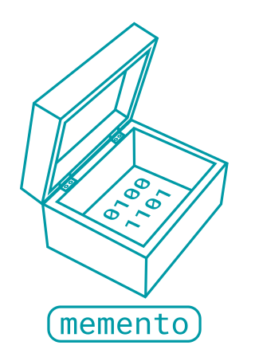

.. Memento documentation master file, created by
   sphinx-quickstart on Thu Oct 25 17:10:41 2018.
   You can adapt this file completely to your liking, but it should at least
   contain the root `toctree` directive.

Welcome to Memento's documentation!
===================================

Memento is a cross-language, federated system of interdependent data functions
that cooperate to provide authorized parties with universal access to
incrementally transformed data.

.. toctree::
   :maxdepth: 2
   :caption: Contents:

   plugins
   serialization

Indices and tables
==================

* :ref:`genindex`
* :ref:`modindex`
* :ref:`search`

Change Log
==========
* :doc:`changelog`

Developer resources
===================

* :doc:`plugins`
* :doc:`serialization`

Modules
=======
The package contains the following modules:

.. autosummary::
   :toctree: _autosummary

   twosigma.memento.call_stack
   twosigma.memento.configuration
   twosigma.memento.context
   twosigma.memento.exception
   twosigma.memento.logging
   twosigma.memento.memento
   twosigma.memento.metadata
   twosigma.memento.partition
   twosigma.memento.reference
   twosigma.memento.resource
   twosigma.memento.resource_function
   twosigma.memento.runner
   twosigma.memento.runner_local
   twosigma.memento.runner_null
   twosigma.memento.runner_test
   twosigma.memento.serialization
   twosigma.memento.storage
   twosigma.memento.storage_filesystem
   twosigma.memento.storage_null
   twosigma.memento.types
